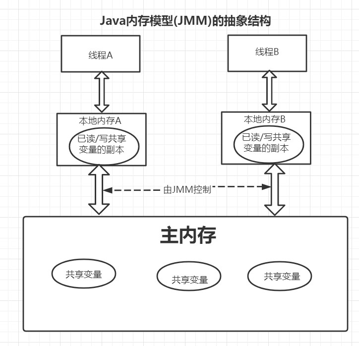

## 计算机网络

## 操作系统

## Java基础

## 并发

## JVM

### 美团

* 1、谈谈对Java内存模型的了解

  **预备知识：**

  * 1、通信机制：
    * 1、在命令式编程中，线程通信的方式有两种：共享内存和消息传递
       * 2、在共享内存的并发模型中，线程之间共享程序的公共状态，通过写读内存中的公共状态来隐式通信。但是同步是显示进行的，程序员必须指定某个方法或者代码块在线程之间互斥执行。
       * 3、在消息传递的并发模型中，线程之间没有公共状态，线程之间必须通过消息传递来显式通信。但是同步是隐式进行的，因为消息发送必须在消息接收之前。
       * 4、Java的并发是采用共享内存模型，整个通信过程都是隐式进行的，对程序员来说是完全透明的。
       * 5、同步是指程序中用于控制不同线程间操作发生相对顺序的机制。

  **Java内存模型(JMM)：**

     * 1、堆内存(存储所有的实例域、静态域、数组元素)在线程之间共享，但是局部变量、方法定义参数、异常处理器参数不会在线程之间共享。
     * 2、Java的线程通信由JMM控制，它定义了线程和主内存之间的抽象关系：线程之间的共享变量都存储在主内存中，每一个线程都会有一个私有的本地内存(用于存储该线程中已读/写共享变量的副本，但不是真实存在的).
       
     * 3、JMM通过控制主内存和每个线程的本地内存之间的交互，来为Java程序提供内存可见性保证。

  **重排序**

  * 1、类别：以下的重排序可能会导致出现内存可见性问题。
    * 编译器级别的重排序：不改变单线程的语义的前提下，重新安排语句的执行顺序。
    * 指令级并行的重排序：现代处理器采用了指令并行技术，如果不存数据依赖性，处理器可以改变指令的执行顺序。
    * 内存系统的重排序：由于缓存和读写缓冲区可能会导致数据读取的速度不一致，使得加载和存储操作可能会存在乱序操作，
  * 2、JMM对于重排序的处理
    * 1、对于编译器级别的重排序，JMM的编译器重排序规则会禁止特定类型的编译器重排序。
    * 2、对于处理器级别的重排序，JMM的处理器重排序规则会要求Java编译器在生成指令序列时插入特定类型的内存屏障，通过内存屏障指令来禁止特定类型的处理器重排序。

  **hapens-before**

  > * 1、从JDK5之后，Java使用新的JSR-133内存模型， 仅仅只允许把一个64位long/double型变量的写操作拆分为两个32位的写操作来执行，任意读操作在JSR-133中都必须具有原子性。
  > * 2、JSR-133模型使用happens-before来描述操作之间的内存可见性。
  > * 3、在JMM之中，如果一个操作的执行结果要对另一个操作可见，那么两个操作之间必须存在happens-before关系，没有对两个操作的执行顺序做要求。两个操作既可以是在一个线程内，也可以在不同的线程之间。
  > * 4、常见的happens-before规则：
  >   * 1、程序顺序规则：一个线程中的每个操作，happens-before于该线程中的任意后续操作。
  >   * 2、监视器锁规则：对一个锁的解锁，happens-before于随后对这个锁的加锁。
  >   * 3、volatile变量规则：对一个volatile域的写，happens-before于任意后续对这个volatile域的读。
  >   * 4、传递性：如果A happens-before B, 且B happens-before C，那么A happens-before C。
  > * 5、一个happens-before规则对应于一个或多个编译器和处理器重排序规则。

  **数据依赖性**

  > * 1、数据依赖性包含3种类型：写后读、写后写、读后写
  > * 2、编译器和处理器在重排序时会遵守数据依赖性，不会改变存在数据依赖关系的两个操作的执行顺序，但是只针对于单个处理器中执行的指令序列和单个线程中执行的操作，不同处理器和不同线程之间的数据依赖不会被编译器和处理器考虑。
  > * 3、当代码中存在控制依赖性时，会印象指令序列执行的并行度，因此编译器和处理器会采用猜测执行来克服控制相关性对并行度的影响。
  >
  > **as-if-serial语义**
  >
  > > * 1、不管怎么重排序，单线程程序的执行顺序不会被改变，编译器、runtime和处理器都必须要遵守as-if-serial语义。
  > > * 2、单线程程序按照顺序执行是依赖于as-if-serial语义保证的。

  **数据竞争和顺序一致性**

  > **数据竞争**
  >
  > * 1、在一个线程中写一个变量
  > * 2、在另一个线程中读同一个变量
  > * 3、写和读没有通过同步来排序
  > * 4、如果程序是正确同步的，程序的执行将具有顺序一致性——即程序的执行结果与该程序在顺序一致性内存模型中的执行结果相同。
  >
  > **顺序一致性内存模型**
  >
  > > 这是一个理想化的参考模型，它提供了极强的内存可见性保证。
  > >
  > > 特性：
  > >
  > > * 1、一个线程中的所有操作必须按照程序的来执行
  > > * 2、不管程序是否同步，所有线程都只能看到一个单一的操作执行顺序。在顺序一致性内存模型中，每个操作都必须原子执行且立刻对所有线程可见。
  >
  > * 1、JMM在具体实现的基本方针为：在不改变程序执行结果的前提下，尽可能的进行编译器和处理器的优化
  > * 2、JMM不保证未同步程序的执行结果与该程序在顺序一致模型中的执行结果一致。
  > * 3、JMM不保证对64位的long型和double型变量的写操作具有原子性，而顺序一致性模型保证对所有的内存读写操作都具有原子性。

  **volatile**

  > * 1、对一个volatile变量的读，总是能看到(任意线程)对这个volatile变量最后的写入。
  > * 2、对任意单个volatile变量的读/写具有原子性，但类似于v++这种复合操作不具有原子性。
  > * 3、从JSR-133开始，volatile变量的写-读可以实现线程之间的通信(一个线程向主内存中写一个volatile变量，另一个线程从主内存中读取之前某个线程写入的volatile变量，实质是一个线程通过主内存向另一个线程发送消息)。
  > * 4、volatile写的内存语义：当写一个volatile变量时，JMM会把该线程对应的本地内存中的共享变量值刷新到主内存中。
  > * 5、volatile读的内存语义：当写一个volatile变量时，JMM会把该线程对应的本地内存置为无效，然后从主内存中读取共享变量。
  >
  > **volatile语义的实现**
  >
  > > * 1、为了实现volatile的内存语义，编译器生成字节码时，会在指令序列中插入内存屏障来禁止特定类型的处理器重排序。
  > > * 2、volatile的读-写具有锁的释放-获取相同的内存语义。
  > > * 3、JMM采取保守的内存屏障插入策略：==》可以保证在任意处理器平台上，任意的程序中都能得到正确的volatile内存语义。
  > >   * 1、在每个volatile写操作的前面插入一个StoreStore屏障(保证上面的所有的普通写都在volatile写之前刷新到主内存中)。
  > >   * 2、在每个volatile写操作的后面插入一个StoreLoad屏障(避免volatile写与后面可能有的volatile读/写操作重排序)。
  > >   * 3、在每个volatile读操作的后面插入一个LoadLoad屏障(禁止处理器把上面的volatile读与下面的普通读重排序)。
  > >   * 4、在每个volatile读操作的后面插入一个LoadStore屏障(禁止处理器把上面的volatile读与下面的普通写重排序)。

  **锁**

  > * 1、锁不仅可以让临界区互斥执行，还可以让释放锁的线程向获取锁的另一个线程发送消息。
  > * 2、当线程释放锁时，JMM会把该线程对应的本地内存中的共享变量刷新到主内存中。
  > * 3、当线程获取锁时，JMM会把该线程对应的本地内幕才能置为无效，从而使得被监视器保护的临界区代码必须从主内存中读取共享变量。
  >
  > **锁的内存语义(以ReentrantLock锁为例)**
  >
  > > * 1、ReentrantLock的实现依赖于AbstractQueueSynchronizer，简称为AQS
  > > * 2、AQS使用了一个整型的volatile变量来维护同步状态。
  > > * 3、CAS：如果当前状态值等于预期值，则以原子方式将同步状态设置为给定的更新值，具有volatile读和写的内存语义，因为CAS是基于volatile变量state来实现的。
  > >
  > > **ReentrantLock**
  > >
  > > * 1、公平锁和非公平锁释放时，最后都要写一个volatile变量state
  > > * 2、公平锁获取时，首先会去读volatile变量。
  > > * 3、非公平锁获取时，首先会用CAS更新volatile变量，这个操作同时具有volatile读和volatile写的内存语义。
  >
  > *锁的内存语义的实现*
  >
  > * 1、利用volatile变量的写-读所具有的内存语义。
  > * 2、利用CAS所附带的volatile读和volatile写的内存语义。

  **final域的重排序规则**

  > **重排序规则**
  >
  > * 1、在构造函数类对一个final域的写入，与随后把这个被构造对象的引用赋值给一个引用变量，这两个操作之间不能重排序。
  > * 2、初次读一个包含final域的对象的引用，与随后初次读这个final域，这两个操作之间不能进行重排序。

* 2、对G1垃圾收集器的算法细节的了解

> * 1、G1收集器开创了收集器面向局部的设计思路和基于Region的内存布局形式。
> * 2、G1是一款主要面向服务端应用的垃圾收集器。
> * 3、其他收集器收集的范围要么是整个新生代或者整个老年代或者整个Java堆，但是G1面向堆内存的任何部分组成回收集进行回收，考虑的是怎么回收才可以得到最大效益，即Mixed  GC。
>
> **Region**
>
> * 1、G1把连续的Java堆划分为多个大小相等的独立区域(Region),而每一个Region都可以扮演新生代的Eden、Survivor空间或者老年代空间，从而实现分代收集。
> * 2、Region还有一类特殊的Humongous区域，专门用于存储大对象，G1认为只要超过Region大小(可以动态调整)的一半即为大对象，而那些超过Region大小的大对象则被存放在多个连续的Humongous Region区域中。
> * 3、G1可以建立可预测的停顿时间模型，是因为G1将Region作为最小的回收单元，每次回收的内存空间都是Region大小的整数倍。
> * 4、G1的收集思路：让G1收集器去跟踪各个Region里面的垃圾堆积的价值大小(价值就是回收所获得的空间大小以及回收所需时间的经验值)，然后在后台维护一个优先级列表，每次根据用户设定允许的收集停顿时间优先处理回收价值收益最大的那些Region。
> * 5、使用Region划分内存空间，以及具有优先级的垃圾回收方式保证了G1收集器在有限的时间内获得尽可能高的效率。
>
> **G1收集器的细节问题**
>
> * 1、将Java划分为多个独立Region后，对于跨Region的引用对象如何解决？
>
>   ```
>   1、使用记忆集避免全堆作为GC Roots扫描。
>   2、每个Region都会维护自己的记忆集，记录别的Region指向自己的指针，并标记这些指针在哪些卡页的范围内。
>   3、G1的记忆集本质是一种哈希表，key是别的Region的起始地址，value是存储卡表的索引号的集合。
>   4、由于Region数量较传统收集器的分代数量要多得多，因此有更高的内存占用负担。
>   ```
>
> * 2、在并发标记阶段如何保证收集线程与用户线程互不干扰的运行？
>
>   ```
>   1、用户线程改变对象引用关系时，必须保证其不能打破原本的对象图结构，导致标记结果出现错误，CMS是采用增量更新算法实现，而G1采用原始快照算法实现。
>   2、对于在回收过程中新创建对象的内存分配上，G1为每一个Region设计了两个名为TAMS的指针，把Region的一部分空间划分出来用于并发回收过程中的新对象分配，并发回收时新分配的对象地址都必须要在这个指针位置之上，G1默认这两个指针是被隐式标记过的，即默认是存活的，不纳入回收范围。
>   3、如果内存回收的速度赶不上内存分配的速度，G1会被迫冻结用户线程执行，导致Full GC而产生长时间的Stop The World,类似于CMS的"Concurrent Mode Failure"失败会导致Full GC。
>   ```
>
> * 3、怎么建立可靠的可预测的停顿时间模型
>
>   ```
>   1、G1的停顿预测模型是以衰减均值为理论基础实现的。
>   2、在垃圾回收过程中，G1会记录每个Region的回收价值(回收所得空间、所耗时间等可测量的步骤)，然后分析得出平均值、标准偏差、置信度等统计信息。然后G1通过这些信息预测现在开始回收的话，由哪些Region组成回收集才可以在不超过期望停顿时间的约束下获得最高的收益。
>   3、“衰减平均值”会比普通平均值更容易受到新数据的影响，“衰减平均值”可以更准确的代表最近的平均值，Region的统计状态越新越能决定其回收的价值。
>   ```
>
> **G1收集器的运作过程**
>
> * 1、**初始标记**：仅仅只是标记一下GC Roots能直接关联到的对象，并且修改TAMS指针的值，让下一阶段用户线程并发运行时，能正确的在可用的Region中分配对象，这个阶段需要停顿线程，但是时间很短，并且是借用Minor GC同步完成的。
>
> * 2、**并发标记**：从GC  Roots进行可达性分析，递归扫描整个堆里的对象图，找出要回收的对象，耗时较长，但是可以和用户线程并发执行。当对象图扫描完成以后，还要重新处理原始快照(STAB)记录下的在并发时有引用变动的对象。
>
> * 3、**最终标记**：对用户线程做另一个短暂的暂停，用于处理并发阶段结束后遗留的最后少量的STAB记录。
>
> * 4、**筛选回收**：负责更新Region的统计数据，对各个Region的回收价值和成本进行排序，根据用户所期望的停顿时间来制定回收计划，自由选择多个Region作为回收集，然后把回收集的Region中存活的对象复制到空的Region中，然后将回收集的全部Region清理掉。由于这里涉及对象的复制，是需要暂停用户线程，由多条收集线程并行完成的。
>
>   **ps**：
>
>   * 1、G1收集器除了并发标记不需要暂停用户线程，其余阶段都是需要暂停用户线程的。
>   * 2、G1从整体上来看采用了标记-整理算法，从局部上来看又是基于标记-复制算法，这两种算法都意味着G1工作期间不会产生内存空间碎片，垃圾收集后可以提供规整的内存空间。
>   * 3、G1相比于CMS来说，记忆集可能会占到整个堆容量的20%甚至更多的内存，而CMS的卡表就只有一份，而且只需要出老年代和新生代就可以了，并且G1的卡表也要复杂的多。
>   * 4、G1和CMS都使用写后屏障来维护卡表操作，但是G1的卡表维护更加复杂。
>   * 5、原始快照(STAB)搜索需要使用写前屏障来跟踪并发时的指针变化情况，相比于增量更新算法，STAB能够减少并发标记和重新标记阶段的消耗。
>   * 6、G1对写屏障的操作较CMS更复杂，因此CMS的写屏障就是直接的同步操作，而G1却需要将其实现为类似消息队列的结构。

* 3、对红黑树的了解？有什么特点

  **二叉查找树(BST)**

  > * 1、左子树上的所有节点的值均小于等于它的根节点的值。
  > * 2、右子树上的所有节点的值均大于等于它的根节点的值。
  > * 3、左右子树也分别为二叉查找树。

  **红黑树**

  > 红黑树可以解决二叉搜索树多次插入数据导致不平衡的问题。
  >
  > 红黑树是一种自平衡的二叉查找树。
  >
  > 红黑树从根节点到叶子节点的最长路径不会超过最短路径的两倍。
  >
  > **特点**：
  >
  > * 1、每个节点都是红色或者黑色的。
  > * 2、根节点是黑色的。
  > * 3、每个叶节点是黑色的。
  > * 4、每个红色节点的两个子节点都是黑色的 -->从每个叶子到根的所有路径上不能有两个连续的红色节点。
  > * 5、从任一节点到其每个叶子节点的所有路径都包含相同数目的黑色节点。
  >
  > **红黑树的调整方法**：
  >
  > * 1、变色：为了满足红黑树的规则，尝试把红色节点变为黑色，或者把黑色节点变为红色。
  > * 2、旋转：
  >   * 左旋转：逆时针旋转红黑树的两个节点，使得父节点被自己的右孩子取代，而自己成为自己的左孩子。
  >   * 右旋转：顺时针旋转红黑树的两个节点，使得父节点被自己的左孩子取代，而自己成为自己的右孩子。
  >
  > **红黑树的应用**
  >
  > * 1、JDK的集合类TreeMap和TreeSet的底层为红黑树，而且JDK8的HashMap底层实现也使用了红黑树。

* 4、HashMap的底层原理

  **JDK1.7**

  > **存储结构**
  >
  > * 1、内部包含了一个Entry类型的table数组，Entry类型用来存储键值对、哈希值以及next字段。
  > * 2、数组的每个位置被当做一个桶，然后每个桶里面放链表。
  > * 3、HashMap使用拉链法来解决同一个链表中存放哈希值和散列桶取模运算相同的Entry。
  > * 4、链表的插入方式是采用的头插法。
  > * 5、HashMap插入数据时是采用取模运算来计算应该插入的位置，如果可以保证HashMap的capacity的值为2的n次方，那么就可以将取模转化为与运算。
  > * 6、HashMap构造函数允许用户传入的容量不是2的n次方，但是内部会自动将其转化为2的n次方。
  >
  > **扩容**
  >
  > * 1、当HashMap的size大于等于阈值threshold时就会触发扩容。
  > * 2、扩容使用resize()方法实现需要把oldtable的所有键值对重新插入到newTable中。
  > * 3、扩容后需要重新计算每个节点的下标，而如果HashMap的capacity为2的n次方，那么就可以加速确定的下标的过程。
  >
  > **其他**
  >
  > * 1、从JDK1.8开始，一个桶的存储的链表长度大于等于8时会将链表转化为红黑树。
  > * 2、和Hashtable的比较：
  >   * 1、Hashtable是线程安全的，使用synchronized来同步。
  >   * 2、HashMap可以插入键值为null的Entry
  >   * 3、HashMap的迭代器是fail-fast迭代器。
  >   * 4、HashMap不能保证随着时间的推移Map元素次序是不变的。

* 5、类加载过程

* 6、说说MySQL的索引结构？为什么用B+树而不用哈希和B树？

* 7、InnoDB和MyISAM的索引结构的区别？InnoDB主键索引和联合索引结构上的区别？InnoDB和MyISAM还有哪些区别？

* 8、分库分表

* 9、redis用过吗？一般怎么使用redis？redis的底层结构？为什么要使用Redis？了解Redis持久化吗

## MySQL

## Redis

## Spring

## Mybatis

## SpringBoot

## 微服务

## 算法题

### 美团

* 1、合并有序数组

  ```java
  /**
  给出两个有序的整数数组 和 ，请将数组 合并到数组 中，变成一个有序的数组
  注意：
  可以假设 数组有足够的空间存放 数组的元素， 和 中初始的元素数目分别为 和 
  */
  public class Solution {
      public void merge(int A[], int m, int B[], int n) {
          int index = m + n - 1;
          int p1 = m - 1;
          int p2 = n - 1;
          while (p1 >= 0 && p2 >= 0) {
              A[index--] = A[p1] > B[p2] ? A[p1--] : B[p2--];
          }
          while (p1 >= 0) {
              A[index--] = A[p1--];
          }
          while (p2 >= 0) {
              A[index--] = B[p2--];
          }
      }
  }
  ```

  

* 2、删除链表的倒数第n个节点

  ```java
  /**
   * Definition for singly-linked list.
   * public class ListNode {
   *     int val;
   *     ListNode next;
   *     ListNode() {}
   *     ListNode(int val) { this.val = val; }
   *     ListNode(int val, ListNode next) { this.val = val; this.next = next; }
   * }
   */
  /**
  给定一个链表，删除链表的倒数第 n 个节点，并且返回链表的头结点。
  
  示例：
  
  给定一个链表: 1->2->3->4->5, 和 n = 2.
  
  当删除了倒数第二个节点后，链表变为 1->2->3->5.
  
  来源：力扣（LeetCode）
  链接：https://leetcode-cn.com/problems/remove-nth-node-from-end-of-list
  著作权归领扣网络所有。商业转载请联系官方授权，非商业转载请注明出处。
  */
  class Solution {
      public ListNode removeNthFromEnd(ListNode head, int n) {
          ListNode cur = head;
          //先找第n个节点
          for (int i = 0; i < n; i++) {
              if (cur == null) {
                  return null;
              }
              cur = cur.next;
          }
          //使用虚拟节点，防止出现只有一个节点被删除的情况
          ListNode root = new ListNode(0);
          root.next = head;
          ListNode tmp = head;
          //保存前一个节点，当找到需要删除的节点后方便删除
          ListNode pre = root;
          //让tmp从开始遍历，cur从第n个节点开始遍历，那么当cur走到null的时候，tmp也就走到了倒数第n个节点
          while (cur != null) {
              cur = cur.next;
              pre = tmp;
              tmp = tmp.next;
          }
          //删除节点
          pre.next = tmp.next;
          return root.next;
      }
  }
  ```

  